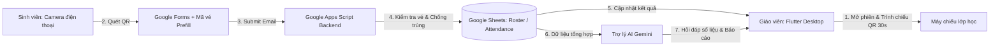

# QR Attendance - Hệ Thống Điểm Danh Sinh Viên Thông Minh

<p align="center">
  
  
  
  
  
</p>

> **Hệ thống điểm danh thông minh qua mã QR động 30 giây** dành cho giảng viên trên ứng dụng **Flutter Windows Desktop**, kết hợp với **Google Forms** (không cần cài app phía sinh viên), **Google Apps Script**, **Google Sheets** làm cơ sở dữ liệu và **Trợ lý AI** phân tích số liệu chuyên cần.

---

## 📖 1. Giới thiệu dự án (About the Project)

### 🚨 Vấn đề thực tế (Pain Points)
- **Điểm danh thủ công:** Tốn 10–15 phút đầu giờ học, dễ nhầm lẫn khi sĩ số lớp đông.
- **Điểm danh bằng mã QR tĩnh thông thường:** Sinh viên dễ dàng chụp ảnh màn hình (screenshot) rồi gửi qua Zalo/Messenger cho bạn ở ngoài lớp quét điểm danh hộ.
- **Rào cản cài đặt:** Bắt buộc sinh viên cài thêm ứng dụng riêng hoặc bắt buộc đăng nhập tài khoản trường gây chậm trễ, nghẽn mạng và phiền toái.

### 💡 Giải pháp của hệ sinh thái QR Attendance
1. **Ứng dụng Giáo viên (Flutter Desktop):**
   - Quản lý ca học, chọn lớp, mở/đóng phiên điểm danh an toàn.
   - Trình chiếu mã QR động trên máy chiếu lớp học, tự động xoay vòng sinh mã vé mới sau mỗi **30 giây**.
   - Tự động nhận diện khi máy tính bị sleep/gập màn hình và làm mới mã ngay khi resume, không bao giờ hiển thị mã quá hạn.
   - Lưu cache phiên làm việc cục bộ; nếu lỡ tay tắt ứng dụng hoặc mất mạng, ứng dụng tự động khôi phục đúng phiên đang mở.
2. **Sinh viên quét QR (Google Forms):**
   - Không cần cài app hay đăng nhập phức tạp. Chỉ cần mở camera điện thoại quét QR -> tự động chuyển hướng đến Google Form với **Mã vé (Ticket)** đã được điền sẵn (prefill). Sinh viên chỉ cần điền Email để xác nhận.
3. **Bộ xử lý Backend (Google Apps Script & Google Sheets):**
   - Xác thực thời hạn vé theo cơ chế **Grace Period** (sinh viên quét ở giây thứ 29 vẫn được nộp hợp lệ ở giây 40).
   - Cơ chế chống gian lận & chống submit trùng lặp (mỗi sinh viên chỉ tính 1 lần/phiên, các lần nộp lại được ghi vào bảng cảnh báo).
   - Đối chiếu với bảng danh sách lớp (Roster) để tự động xuất danh sách sinh viên vắng mặt sau khi giáo viên đóng phiên.
4. **Trợ lý AI (Gemini / LLM):**
   - Tích hợp khung chat thông minh hỏi đáp nhanh số liệu điểm danh.
   - Nút bấm tạo báo cáo tự động tóm tắt tình hình chuyên cần của buổi/tuần.

---

## 🏗️ 2. Kiến trúc Hệ thống & Luồng Dữ liệu (Architecture)



---

## 👥 3. Phân công Nhân sự & Trách nhiệm (Team Roles)

Dự án được phân chia thành 5 vai trò chuyên biệt theo hệ thống Issue trên GitHub:

| Thành viên | Phân hệ phụ trách | Issue chính | Mô tả nhiệm vụ |
| :--- | :--- | :---: | :--- |
| **Người 1** | **Flutter Desktop (Core / Phiên & QR)** | `#5`, `#10`, `#21` | Dựng khung App Shell dùng chung, màn hình chọn lớp / mở phiên, trình chiếu QR 30s và đóng phiên an toàn kèm lưu cache khôi phục. |
| **Người 2** | **Flutter Desktop (Bảng kết quả & Lịch sử)** | `#12`, `#22`, `#23` | Hiển thị bảng điểm danh hôm nay theo Roster, cảnh báo submit trùng lặp realtime và tra cứu lịch sử buổi học. |
| **Người 3** | **Apps Script (Backend & Form Integration)** | `#6`, `#7`, `#8` | Sinh mã vé QR 30s, liên kết form prefill, tính hạn theo Grace Period và trigger xử lý submit chống trùng. |
| **Người 4** | **Data Layer & Teacher API** | `#4`, `#9`, `#17` | Thư viện kết nối Google Sheets (Roster/Attendance), API quản lý phiên cho giáo viên và tổng hợp số liệu vắng. |
| **Người 5** | **Tích hợp AI & Nghiệm thu** | `#18`, `#19`, `#24` | Tích hợp LLM (Gemini API), xây dựng khung chat hỏi đáp điểm danh, nút tạo báo cáo AI và nghiệm thu hệ thống. |

---

## ✨ 4. Tính năng Nổi bật (Key Features)

- 🔄 **QR Xoay vòng 30 giây:** Đồng hồ tròn tiến trình đổi màu trực quan (Xanh > 10s, Vàng 5–10s, Đỏ < 5s) và tự động cấp mã vé thế hệ tiếp theo (`#Gen`).
- 🖥️ **Chế độ Trình chiếu Máy chiếu (Fullscreen):** Nút phóng to / thu nhỏ tối ưu kích thước hiển thị cho hội trường lớn.
- ⚡ **Chống bấm liên tục (Anti-Double-Click):** Tích hợp tiện ích `Debouncer` và state guard ngăn chặn việc bấm đúp tạo trùng phiên hoặc đóng lặp.
- 🛡️ **Khôi phục trạng thái khi sự cố (State Restoration):** Tự động lưu cache `session_cache.json`; khôi phục chính xác phiên đang mở nếu app bị tắt đột ngột, tuyệt đối không mở lại phiên đã đóng.
- 🛑 **Đóng phiên an toàn & Không báo thành công giả:** UI dừng QR ngay lập tức và đợi phản hồi xác nhận từ máy chủ với timeout 5 giây.
- 📋 **Hộp thoại Tổng kết Chốt sổ:** Cung cấp thông tin phiên đã đóng thành công và điều hướng sang tab Bảng điểm danh của Người 2.

---

## 📂 5. Cấu trúc Thư mục Dự án (Project Structure)

Dự án được tổ chức theo kiến trúc **Feature-First / Clean Architecture**:

```text
flutter-qr-attendance/
├── lib/
│   ├── core/                        # Nền tảng cốt lõi
│   │   ├── constants/
│   │   │   ├── app_colors.dart      # Bảng màu chuẩn Material 3 & Dark Sidebar
│   │   │   └── app_typography.dart  # Định dạng font chữ và tiêu đề
│   │   ├── storage/
│   │   │   └── session_storage.dart # Quản lý cache khôi phục phiên (File & Memory)
│   │   └── utils/
│   │       └── debouncer.dart       # Bộ đệm chống click đúp
│   ├── data/                        # Tầng Dữ liệu & Dịch vụ
│   │   ├── models/
│   │   │   ├── class_model.dart     # Model môn học và thông tin lớp
│   │   │   ├── qr_ticket_model.dart # Model vé QR đếm ngược 30 giây
│   │   │   └── session_model.dart   # Model phiên học và ca học (Slot)
│   │   └── services/
│   │       └── attendance_service.dart # Service Interface & Mock Implementation
│   ├── providers/
│   │   └── session_provider.dart    # Quản lý trạng thái phiên, timer 30s và vòng đời
│   ├── views/                       # Giao diện Người dùng
│   │   ├── ai_assistant/
│   │   │   └── ai_assistant_placeholder_view.dart # Không gian tích hợp của Người 5
│   │   ├── attendance/
│   │   │   └── attendance_placeholder_view.dart   # Không gian tích hợp của Người 2
│   │   ├── session/
│   │   │   ├── qr_display_view.dart        # Màn hình chiếu QR 30s & Đóng phiên (Người 1)
│   │   │   └── session_selection_view.dart # Màn hình chọn lớp & Mở phiên (Người 1)
│   │   └── shell/
│   │       └── app_shell.dart              # Khung giao diện Sidebar Navigation chung
│   └── main.dart                    # Entry point của ứng dụng
├── test/                            # Bộ kiểm thử tự động
│   ├── qr_timer_test.dart           # Unit test bộ đếm 30s và tính hạn vé
│   ├── session_recovery_test.dart   # Unit test lưu cache và khôi phục phiên
│   └── widget_test.dart             # Smoke test giao diện điều hướng
├── pubspec.yaml                     # Danh sách thư viện phụ thuộc
└── README.md                        # Tài liệu hướng dẫn dự án
```

---

## 💻 6. Yêu cầu Hệ thống & Cài đặt (Prerequisites)

### Yêu cầu môi trường máy tính
- **Hệ điều hành:** Windows 10/11 (64-bit).
- **Flutter SDK:** Phiên bản `3.13.x` trở lên (Đã kiểm thử mượt mà trên `Flutter 3.47.4 stable`).
- **Visual Studio 2022:** Đã cài đặt gói workload **"Desktop development with C++"** (Bắt buộc để build ứng dụng Windows Desktop).
- **Git:** Phiên bản `>= 2.40`.

### Các bước cài đặt
1. **Clone repository về máy:**
   ```bash
   git clone https://github.com/danhnguyenthanh260/flutter-qr-attendance.git
   cd flutter-qr-attendance
   ```

2. **Cài đặt các gói thư viện phụ thuộc:**
   ```bash
   flutter pub get
   ```

3. **Kiểm tra môi trường Windows Toolchain:**
   ```bash
   flutter doctor
   ```
   *(Đảm bảo mục `Visual Studio - develop Windows apps` và `Connected device: Windows (desktop)` có dấu tích xanh).*

---

## 🚀 7. Hướng dẫn Chạy Ứng Dụng & Kiểm Thử (Run & Test)

### 1. Khởi chạy ứng dụng Windows Desktop
```bash
flutter run -d windows
```

### 2. Chạy toàn bộ các bài kiểm thử tự động (Unit & Widget Tests)
```bash
flutter test
```
*(Kết quả kỳ vọng: `All tests passed! (10/10)`).*

### 3. Kiểm tra chất lượng mã nguồn (Static Code Analysis)
```bash
flutter analyze
```
*(Kết quả kỳ vọng: `No issues found!`)*.

---

## 📐 8. Quy ước Đóng Góp Mã Nguồn (Git Conventions)

Dự án áp dụng quy trình Git Flow chuyên nghiệp:

### 1. Quy tắc đặt tên nhánh (Branch Naming)
- Tính năng mới: `feat/person-<số>-issue-<id>-<tên_ngắn>`
  - *Ví dụ:* `feat/person-1-issue-5-setup-session`
- Sửa lỗi: `fix/person-<số>-issue-<id>-<tên_lỗi>`
- Tài liệu: `docs/<tên_tài_liệu>`

### 2. Quy tắc viết Commit (Conventional Commits)
Mỗi commit cần có tiền tố rõ ràng và tham chiếu issue nếu có:
- `feat(scope): mô tả tính năng mới (refs #id)`
- `fix(scope): mô tả lỗi đã sửa (fixes #id)`
- `chore(scope): công việc cấu hình, phụ thuộc`
- `docs(scope): cập nhật tài liệu`
- `test(scope): bổ sung kiểm thử tự động`

### 3. Quy trình Pull Request (PR Workflow)
1. Đẩy nhánh lên remote repository: `git push -u origin <tên_nhánh>`.
2. Tạo Pull Request qua GitHub CLI hoặc giao diện web:
   ```bash
   gh pr create --title "feat(scope): tiêu đề PR (closes #<id>)" --body "Mô tả chi tiết..."
   ```
3. Chạy `flutter test` và `flutter analyze` trước khi merge.
4. Hợp nhất PR vào nhánh `main` và dọn dẹp nhánh phụ:
   ```bash
   gh pr merge <pr_number> --merge --delete-branch
   ```

---

## 📜 9. Bản Quyền & Tác Giả (License & Team)

- **Đề tài:** Hệ thống Điểm danh Sinh viên bằng Mã QR Thông minh (QR Attendance System).
- **Mã nguồn:** Phát hành theo giấy phép [MIT License](LICENSE).
- **Nhóm phát triển:** Nhóm 1–5 (FPT University).
